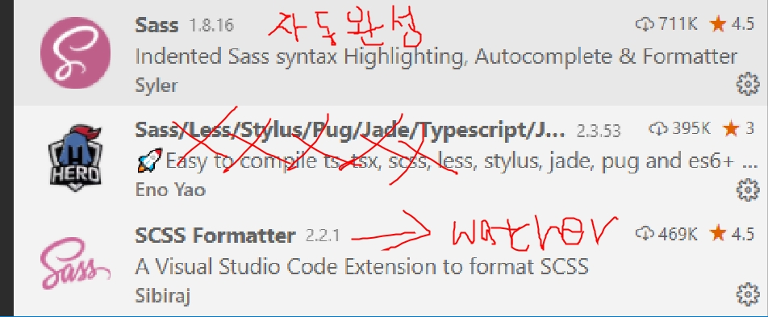
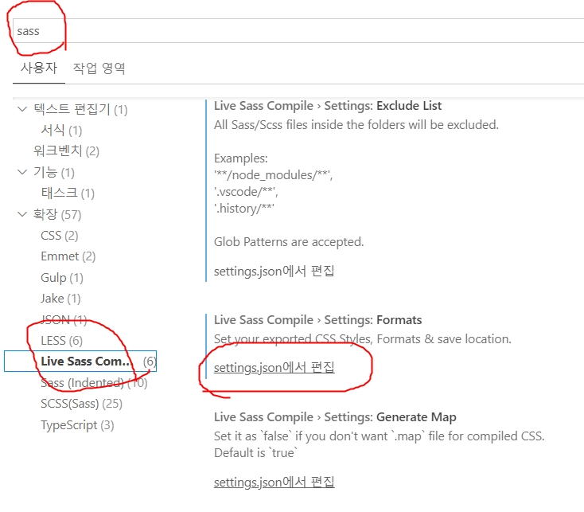
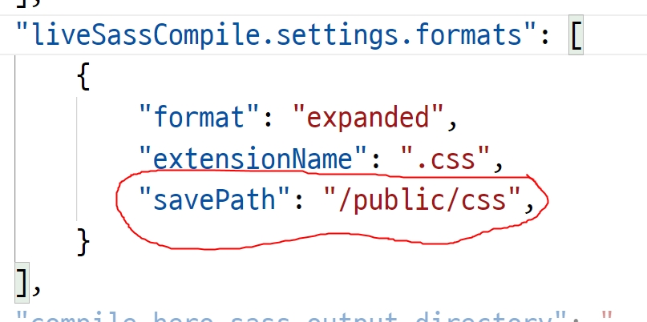
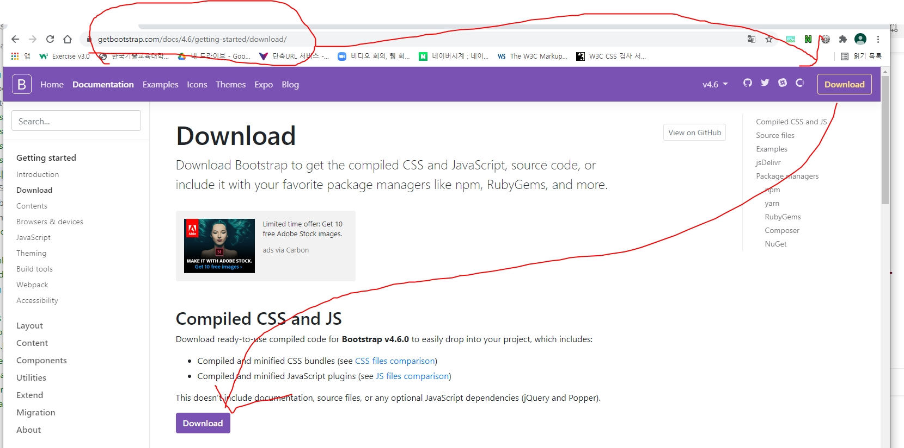
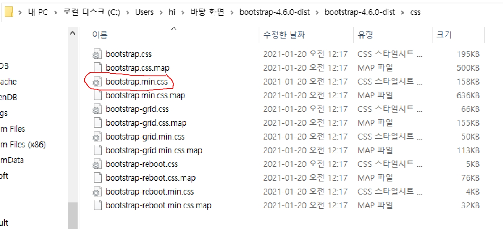
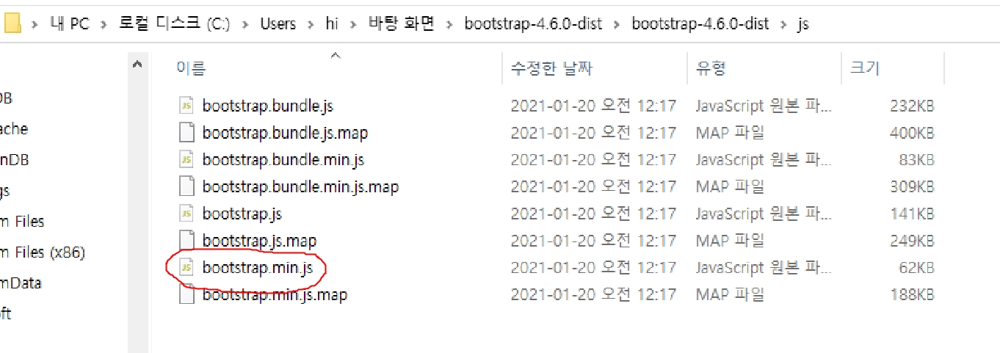

# 그동안 배운 내용 정리
## vscode 설치 - 확장기능(캡쳐)
## [깃 다운로드](https://git-scm.com) : CMD창에서 (git init)
```bash
# 관리할 폴더로 이동해서 git bash를 열고
git init
git remote add origin https://github.com/booldook/my-html.git
```
## [node 다운로드](https://nodejs.org) : npm명령을 사용하기 위해 설치
## 파이어베이스 설치
```bash
# 설치(한번만)
npm i -g firebase-tools

# 프로젝트 설정
# firebase.com에서 프로젝트를 만들고.
# 프로젝트를 만들 폴더로 이동해서, 탐색기의 context menu 에서 git bash열기
firebase init
> hosting (화살표로 이동하고 스페이스로 선택 후 엔터)
> use existing project(?) <= 선택
# 위의 명령 실행 후 본인 프로젝트 선택 후 엔터
# 폴더 어디로? (public)
# index.html(N)
# git?(N)
# 완료!!
```
## 모든 작업파일을 public 폴더에 이동하고 public/index.html 파일의 내용을 모두 지우고 아래의 내용을 넣는다.
```html
<meta http-equiv="refresh" content="0;./html/index.html">
```
## 배포
```bash
firebase deploy
```

# SCSS 사용




## 단 watching모드는 *.scss파일에서만 활성화되므로 다른 확장자에선 당황하지 않기

# bootstrap 다운로드 및 사용하기
[bootstrap 다운로드](https://getbootstrap.com)




# jquery는 현재폴더의 jquery-3.5.1.js 를 가져가면 된다.


# git checkout/branch/merge
[git 동영상강의](https://opentutorials.org/module/3733)

# 협업툴
- jira, confulence, slack, notion, trello